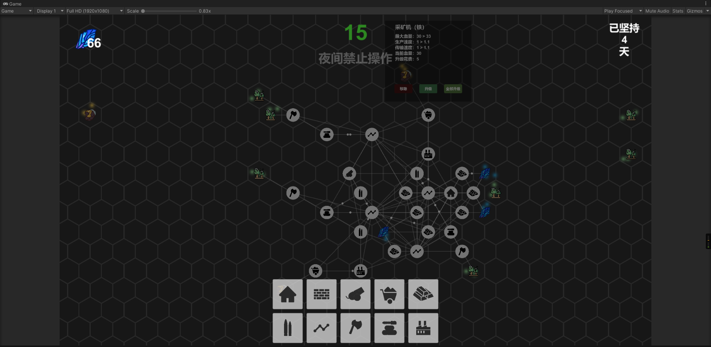

# Unity 一学期 期末大作业




# 一、介绍

**无尽黑夜：**

一个经营类的塔防2D游戏，需要玩家放置不同的物品来利用场景中的资源来打造自己的村庄。

⚠️：每隔30秒会有夜幕降临，在黑夜之中，会有幽灵👻来进攻你的大本营，且幽灵会越来越强，你要做的就是保护村庄，度过一个个黑夜。

**内容介绍：**

本游戏设置十种建筑，三种自然资源与地形，还有一种人造资源，以及敌人幽灵。

1. 三种自然资源（地形）：
    1. **水晶（水晶矿）**：游戏中的货币，需要通过挖掘水晶矿才能获得。
    2. **木材（森林）**：材料，用于和铁锭合成子弹。
    3. **铁（铁矿）**：材料，用于和木材一起合成为子弹。
2. 人造资源：
    1. **子弹**，使用木材和铁锭合成，供给给大本营和炮台
3. 十种建筑：
    1. **大本营**：主要建筑，储存水晶，具有攻击能力，需要子弹工厂为其供应子弹
    2. **城墙**：血量较多，用于抵御幽灵的进攻
    3. **炮台**：攻击幽灵，需要子弹工厂为其供应子弹，只能放置在子弹加工厂或者运输器附近
    4. **采矿机（铁）**：采集铁矿，运输给加工厂（铁矿）加工成铁锭，只能放置在铁矿附近
    5. **水晶采集器**：采集水晶，作为通用货币使用，直接供应给大本营，只能放置在水晶矿附近
    6. **子弹加工厂**：需要木材和铁锭才能制造子弹，只能放置在加工厂（木材）和加工厂（铁）或者运输器附近
    7. **运输器**：可以运输除未处理的木材和铁矿之外的任何东西
    8. **伐木机**：砍伐树木，运输给加工厂（木材）加工，只能放置在森林附近
    9. **加工厂（木材）**：通过伐木机送来的树木加工成木材，只能放置在伐木机或者运输器附近
    10. **加工厂（铁）**：通过采矿机（铁）运输来的铁矿石加工成铁锭，只能放置在采矿机（铁）附近。
4. **幽灵**，会不顾一切的冲向大本营，并摧毁路途中的建筑

# 二、实现

主要类关系图


## 1、搭建UI

…..

通过点击选择建筑，在地图上创建。通过了一个GameManager来交换数据。

## 2、地图功能

### (1)选择放置

选择了蜂窝状的网格地图，网格地图有一个优点，可以直接获取我的鼠标在那个网格上，方便放置建筑。至于为何选择**蜂窝状**的，纯属脑抽（记住蜂窝地图，后面要考的）。

通过查阅资料，暂时没有找到鼠标移入移出网格的事件，通过自己实现监听上一次鼠标滑动的位置来比较是否移入移出网格。

```csharp
/// <summary>
/// 鼠标在瓦片上事件
/// </summary>
private void OnMouseToTileListener()
{
    // 获取坐标
    var mousePos = m_Camera.ScreenToWorldPoint(Input.mousePosition);
    var cellPos = m_Tilemap.WorldToCell(mousePos);
    // 如果坐标改变，则触发事件
    if (m_PreVector3Int != cellPos && m_Tilemap.HasTile(cellPos))
    {
        m_CurVector3Int = cellPos;
        OnMouseExitTile(m_PreVector3Int);
        OnMouseEnterTile(cellPos);
        m_PreVector3Int = cellPos;
    }
}
/// <summary>
/// 鼠标滑入瓦片事件
/// </summary>
/// <param name="cellPos">瓦片的坐标</param>
private void OnMouseEnterTile(Vector3Int cellPos) { }

/// <summary>
/// 鼠标滑出瓦片的事件
/// </summary>
/// <param name="cellPos">瓦片的坐标</param>
private static void OnMouseExitTile(Vector3Int cellPos) { }
```

当滑动到不同的网格时，选中的物体跟随鼠标切换到不同的网格中。通过左键点击放置，右键点击取消放置（功能过于简单不过多讲解）

放置建筑以后，需要将其保存到 GameManager 中备用，具体实现在下文。

### (2)地图变化功能

通过监听鼠标按下获取位置偏移来改变摄像头位置。通过鼠标滚轮监听来改变摄像头的观测大小。

## 3、放置功能

### (1)扫描

需要实现完整的放置功能，首先需要实现各个建筑的控制类，只有以判断是否与对应的建筑建立线路。这里先假设建筑可以与所有物体建立联系。

首先，需要建立联系，我们就需要一个范围（n），可以定义在建筑类中，我们需要扫描周围 n 圈来判断是否有物体，有物体则连接。

这时就出现了一个极其棘手的问题，在正常的四边形坐标系中，横纵坐标都是直线，而在蜂窝地图中，坐标系就比较抽象了，如下图所示：


而我需要扫描的是绿圈以及向外的范围。并不能通过原有的坐标系很好的计算周围的数值。

这里也就是上文说的选蜂窝地图的问题。

这里我想出了一个解决方案，通过参考数学上的三角函数，设计了一个类似于向量的坐标系：

（层数，索引）

从原点坐标开始，他的值是（0，0），第一圈的值是（1,0~5）其中索引的范围是可以通过层数计算得出 索引最大值 = (层数 * 2 - 1) * 6。由此只需要知道层数，就可以计算出这个范围的物体。

具体实现：

首先需要把`Grid` 组件的`CellSize` 的 XY 比为 1 : (2 / 3 * √3)，小数 1:1.212435565298214

```csharp
using System;
using UnityEngine;
/// <summary>
/// 自定义坐标系统
/// </summary>
public struct LayerPosition
{
    private static float Length = 1f;// 这里写X的值
    public int layer;
    public int position;
    public LayerPosition(int layer, int position = 0)
    {
        this.layer = layer;
        this.position = position;
    }
    /// <summary>
    /// 角度
    /// </summary>
    public float Angle
    {
        get
        {
            if (layer == 0) return 0;
            return 360f / layer / 6f * position;
        }
    }
    /// <summary>
    /// 距离
    /// </summary>
    public float Distance => layer * Length;
    /// <summary>
    /// 此层个数
    /// </summary>
    public int Count
    {
        get
        {
            if (layer == 0) return 1;
            return layer * 6;
        }
    }
    /// <summary>
    /// 计算 Vertor3
    /// </summary>
    /// <returns></returns>
    public Vector3 GetVector3()
    {
        return new Vector3(
            Distance * Mathf.Cos(Angle * Mathf.Deg2Rad),
            Distance * Mathf.Sin(Angle * Mathf.Deg2Rad),
            0
        );
    }
    /// <summary>
    /// 扫描周围的地形
    /// </summary>
    /// <param name="curVector3">当前的坐标</param>
    /// <param name="action">坐标处理回调</param>
    public void Scan(Vector3 curVector3, Action<Vector3> action)
    {
        for (var i = 1; i <= layer; i++)
        {
            for (var j = 1; j <= 6 * i; j++)
            {
                var vector3 = curVector3 + new LayerPosition(i, j);
                action.Invoke(vector3);
            }
        }
    }
    /// <summary>
    /// Vector3 转 LayerPosition
    /// </summary>
    /// <param name="vector3"></param>
    /// <returns></returns>
    public static LayerPosition Vector3ToLayerPosition(Vector3 vector3)
    {
        var layer = Mathf.RoundToInt(vector3.magnitude / Length);
        // 计算vertor3角度
        var angle = Mathf.Atan2(vector3.y, vector3.x) * Mathf.Rad2Deg;
        if (angle < 0) angle += 360;
        var position = Mathf.RoundToInt(angle / (360f / layer / 6f));
        return new LayerPosition(layer, position);
    }
}
```

放置之前会判断是否可以放置，不可放置会显示红色，判断逻辑在各个建筑中。

同时不可放置在已有物体的网格中。

### (2)连线

首先定义一个`Line` 类控制各个建筑之间的的连线显示，以方便控制建筑移动和销毁时改变连线：

```csharp
using System;
using System.Collections.Generic;
using System.Linq;
using Effect;
using Unity.VisualScripting;
using UnityEngine;

/// <summary>
/// 控制线段的大小
/// </summary>
public class Line : MonoBehaviour
{
    public GameObject circle;
    private Vector2 StartPos { get; set; }
    private Vector2 EndPos { get; set; }
    private LayerPosition StartLayerPosition { get; set; }
    private LayerPosition EndLayerPosition { get; set; }
    private float Magnitude { get; set; }
    private float Angle { get; set; }
    private List<GameObject> m_circleList = new();
    private void Awake()
    {
        StartLayerPosition = LayerPosition.Vector3ToLayerPosition(StartPos);
        EndLayerPosition = LayerPosition.Vector3ToLayerPosition(EndPos);
    }
    /// <summary>
    /// 推送资源
    /// </summary>
    /// <param name="direction">true: 向外推送, false: 向内推送</param>
    /// <param name="onFinish">推送完成回调</param>
    public void Push(bool direction, Action onFinish = null)
    {
        var start = StartPos;
        var end = EndPos;
        if (!direction)
        {
            start = EndPos;
            end = StartPos;
        }
        var instantiate = Instantiate(circle,start,Quaternion.identity);
        m_circleList.Add(instantiate);
        this.CreateEffect().AddEffect(instantiate.transform.SlideTFTo(start,end)).Play(() =>
        {
            onFinish?.Invoke();
            m_circleList.Remove(instantiate);
            Destroy(instantiate);
        });
    }
    /// <summary>
    /// 画线
    /// </summary>
    /// <param name="startPos"></param>
    /// <param name="endPos"></param>
    /// <param name="color"></param>
    public static Line DrawLine(Vector2 startPos, Vector2 endPos)
    {
        // 计算角度和距离
        var offset = endPos - startPos;
        var magnitude = offset.magnitude;
        var angle = Mathf.Atan2(offset.y, offset.x) * Mathf.Rad2Deg;
        // 设置长度和角度
        var instantiate = Instantiate(GameManager.Instance.LinePrefab, startPos, Quaternion.identity);
        var localScale = instantiate.transform.localScale;
        localScale.x = magnitude;
        instantiate.transform.localScale = localScale;
        var eulerAngles = instantiate.transform.eulerAngles;
        eulerAngles.z = angle;
        instantiate.transform.eulerAngles = eulerAngles;
        var component = instantiate.GetComponent<Line>();
        component.StartPos = startPos;
        component.EndPos = endPos;
        component.Magnitude = magnitude;
        component.Angle = angle;
        return component;
    }
    private void OnDestroy()
    {
        foreach (var o in m_circleList.Where(o => !o.IsDestroyed()))
        {
            Destroy(o);
        }
    }
}
```

其中提供了`DrawLine` 的静态方法用于画线。

所有连线的数据都保存在GameMagager中的邻接表中，以便后续使用。

## 4、建筑

我将建筑分为五大类：攻击、防御、生产、运输、制造

首先我们需要所有建筑的基类：**`BaseBuild`**，其中保存一些通用数据，如范围、等级等，数据中数据库中获取，实现一些通用方法：

```csharp

/// <summary>
/// 所有建筑的基类
/// </summary>
public abstract class BaseBuild : BaseObstacle
{
    // **************** 属性 *****************
    // 是否放置
    public bool IsPlace
    {
        get => isPlace;
        set => isPlace = value;
    }
    
    // ***************** 引用 ******************
    
    // 血条
    public Slider slider;

    // ***************** 变量 ******************
    // 建筑中文名
    protected string CName;
    // 范围
    protected int distance;
    // 等级
    protected int level;
    // 是否放置
    protected bool isPlace = false;
    // 类型
    protected BuildType buildType;
    // 生命
    protected float hp;
    // 最大生命
    protected int maxHp;
    // 升级价格
    protected int upgradePrice;
    // 价格
    protected int price;
    // 运输速度
    protected float waySpeed;
    // 运输计时
    private float m_wayTimer;
    protected SpriteRenderer spriteRenderer;
    // 连接的障碍
    protected Dictionary<Type, List<BaseObstacle>> obstacles = new();
    // 库存物资
    protected Dictionary<Resource, int> inventory = new();
    // 数据
    protected BuildData m_buildData;
    // 未放置状态的上一步位置
    protected Vector3 m_lastPos;
    // 线条集合
    protected Dictionary<BaseObstacle,Line> m_lineDic = new();
    protected virtual void OnDestroy()
    {
        // 销毁上一次资源
        DestroyPre();
        GameManager.Instance.RemoveNode(this);
    }

    protected virtual void FixedUpdate()
    {
        // 调用移动事件
        OnMove();
        // 判断是否可以调用运输事件
        if (waySpeed!= 0 && isPlace)
        {
            m_wayTimer += Time.fixedDeltaTime;
            if (m_wayTimer >= Constant.DEFAULTTIME / waySpeed)
            {
                m_wayTimer %= Constant.DEFAULTTIME / waySpeed;
                OnWay();
            }
        }
    
    private void OnCollisionStay2D(Collision2D collision)
    {
        // 接触到敌人扣血
        if (collision.gameObject.CompareTag("Enemy"))
        {
            hp -= Time.fixedDeltaTime * 5f;
            slider.gameObject.SetActive(true);
            // 血条显示
            slider.value = hp / maxHp;
        }
        if (hp <= 0)
        {
            Destroy(gameObject);
        }
    }

    private void OnCollisionExit2D(Collision2D other)
    {
        // 敌人离开隐藏血条
        if (other.gameObject.CompareTag("Enemy"))
        {
            slider.gameObject.SetActive(false);
        }
    
    /// <summary>
    /// 展示建筑信息
    /// </summary>
    public virtual void ShowInfo() { }
    /// <summary>
    /// 运输事件
    /// </summary>
    protected virtual void OnWay() { }
    /// <summary>
    /// 移动事件
    /// </summary>
    protected virtual void OnMove()
    {
        if (m_lastPos == transform.position) return;
        m_lastPos = transform.position;
        // 扫描
        Scan();
        // 判断是否可以放置
        if (CanPlace())
        {
            var color = Color.white;
            color.a = 0.3f;
            GetComponent<SpriteRenderer>().color = color;
        }
        else
        {
            var color = Color.red;
            color.a = 0.3f;
            GetComponent<SpriteRenderer>().color = color;
        }

    }
    /// <summary>
    /// 扫描周围的格子
    /// </summary>
    private void Scan()
    {        
        // 销毁上一次资源
        DestroyPre();
        OnScan(out var clean, out var action);
        clean?.Invoke();
        var layerPosition = new LayerPosition(distance);
        GameManager.Instance.Scan(layerPosition, transform.position, obstacle => action?.Invoke(obstacle));
    }
    /// <summary>
    /// 扫描周围的格子
    /// </summary>
    /// <param name="clean">扫描之前的清理</param>
    /// <param name="action">扫描后结果的处理</param>
    protected virtual void OnScan(out Action clean, out Action<BaseObstacle> action)
    {
        clean = null;
        action = null;
    }
    /// <summary>
    /// 添加线
    /// </summary>
    /// <param name="end"></param>
    protected void AddLine(BaseObstacle end)
    {
        m_lineDic.Add(end,Line.DrawLine(transform.position, end.transform.position));
        if (!obstacles.ContainsKey(end.GetType()))
        {
            obstacles.Add(end.GetType(), new List<BaseObstacle>());
        }
        obstacles[end.GetType()].Add(end);
    }
    /// <summary>
    /// 获取线
    /// </summary>
    /// <param name="obs"></param>
    /// <returns></returns>
    public Line GetLine(BaseObstacle obs)
    {
        return m_lineDic[obs];
    }
    public Dictionary<BaseObstacle,Line> GetLines()
    {
        return m_lineDic;
    }
    /// <summary>
    /// 销毁所有线段
    /// </summary>
    protected void DestroyPre()
    {
        foreach (var line in m_lineDic.Where(line => !line.Value.IsDestroyed()))
        {
            Destroy(line.Value.gameObject);
        }
        m_lineDic.Clear();
        obstacles.Clear();
    }
    /// <summary>
    /// 是否可以放置
    /// </summary>
    /// <returns></returns>
    public virtual bool CanPlace()
    {
        return GameManager.Instance.CrystalNum >= price;
    
    /// <summary>
    /// 更改资源
    /// </summary>
    /// <param name="type"></param>
    public virtual void ChangeNum(Resource resource,int num = 1)
    {
        inventory.TryAdd(resource, 0);
        inventory[resource] += num;
    
    public int GetNum(Resource resource)
    {
        return inventory.TryGetValue(resource, out var num) ? num : 0;
    }
    /// <summary>
    /// 询问是否有指定物质
    /// </summary>
    /// <param name="resource"></param>
    /// <returns></returns>
    public virtual bool IsHave(Resource resource)
    {
        return false;
    }
    /// <summary>
    /// 升级
    /// </summary>
    public virtual void Upgrade()
    {
        if (Constant.DEFAULTNUM * level > GameManager.Instance.CrystalNum)
        {
            UIManager.Instance.CreateToast("水晶不足，无法升级");
            return;
        }
        
        if (level >= 5)
        {
            UIManager.Instance.CreateToast("已经升级为最高等级");
            return;
        }
        GameManager.Instance.CrystalNum -= Constant.DEFAULTNUM * level;
        level++;
        spriteRenderer.color = Constant.colors[level - 1];
    }
    /// <summary>
    /// 移除
    /// </summary>
    public virtual void Remove()
    {
        Destroy(gameObject);
    }
}
```

以上是所有建筑的通用功能，具体需要子类实现。

### (1)攻击类型`BaseAttack`

其中实现了对攻击者的目标敌人添加，还有攻击敌人的方法。

- 大本营：无特殊攻击实现
- 加农炮：无特殊攻击实现

### (2)防御类型`BaseDefense`

暂无特殊功能，只能挨打

- 城墙：无特殊功能，只能挨打

### (3)制造机`BaseMaker`

实现了每隔一段时间制造资源，具体制造逻辑提供接口由子类实现。

- 加工厂（木）：通过获取生产者伐木机的资源，生产木材。
- 加工厂（铁）：通过获取生产者采矿机（铁）机的资源，生产铁锭。
- 子弹工厂：通过前两者获取资源，生产子弹

### (4)生产者`BaseProduce`

用于采集地形中的数据，实现每隔一段时间获取物质，具体获取实现由子类实现。

- 水晶采集器：获取水晶地形
- 伐木机：获取树木
- 采矿机：获取铁矿

### (5)运输器`BaseWay`

无具体实现，作为物质传送的中转站。

- 运输线路：作为中转站

建筑会收到幽灵的攻击，血量减为0销毁建筑。升级建筑可将血条拉满。

## 5、地形

地形有三种，分别为森林（**`Tree`**），铁（**`Iron`**），水晶（**`Crystal`**）

他们有一个基类，基类中定义了一个方法：

```csharp
/// <summary>
/// 询问是否需要传出物质
/// </summary>
/// <returns></returns>
public virtual Resource IsOut()
{
    return Resource.None;
}
```

子类实现方法，不同物质返回出的资源不一样

## 6、敌人

将大本营作为目标，每帧都向其靠近一点，并且具有触发器碰撞体，触发到可攻击建筑时，向攻击建筑中注册自身信息，使攻击建筑可以攻击到幽灵。

## 7、功能

主要功能：数据库，动画，物质运输

### (1)数据库

封装了一套数据库的插入与查询方法，我们只需要在代码中调用其接口就能根据类来创建读取数据库。

我们用来保存数据的类需要继承`BaseData` 来保证格式的正确，其中可以拥有主键，主键用注解`PrimaryKey` 表示。如：

```csharp
public class BuildData : BaseData
{
    // 建筑名称
    [PrimaryKey]
    public string buildName;
    // 建筑中文名
    public string name;
    // 范围
    public int distance;
    // 等级
    public int level;
    // 是否放置
    public bool isPlace = false;
    // 类型
    public BuildType buildType;
    // 生命
    public int hp;
    // 升级价格
    public int upgradePrice;
    // 价格
    public int price;
    // 攻击力
    public int attack;
    // 生产速度
    public int productionSpeed;
    // 运输速度
    public int waySpeed;
    // 描述
    public string description;
    
    public override string ToString()
    {
        return $"建筑名称：{name} \n范围：{distance} \n等级：{level} \n是否放置：{isPlace} \n类型：{buildType} \n生命：{hp} \n升级价格：{upgradePrice} \n价格：{price} \n攻击力：{attack} \n生产速度：{productionSpeed} \n运输速度：{waySpeed} \n描述：{description}";
    }
    
}
```

这样我们就可以在代码中直接调用`var isInsert = new InsertWapper<BuildData>(builbdData ).Do();` 来插入数据库，不必在关心Sql语句的编写。

代码会根据保存数据的类名称判断是否有此表，没有的话先创建，再插入。

有插入还有查询，封装了查询的方法：`var buildDatas = new QueryWapper<BuildData>().Do();`

其中提供了条件查询的一系列方法如：

```jsx
public QueryWapper<T> eq(string key, object value)
{
    IsEqual();
    m_Conditions.Add(new Tuple<string, string, object>(key, "=", value));
    return this;
}
// 不等于
public QueryWapper<T> ne(string key, object value)
{
    IsEqual();
    m_Conditions.Add(new Tuple<string, string, object>(key, "!=", value));
    return this;
}
// 大于
public QueryWapper<T> gt(string key, object value)
{
    IsEqual();
    m_Conditions.Add(new Tuple<string, string, object>(key, ">", value));
    return this;
}
// 小于
public QueryWapper<T> lt(string key, object value)
{
    IsEqual();
    m_Conditions.Add(new Tuple<string, string, object>(key, "<", value));
    return this;
}
// 大于等于
public QueryWapper<T> ge(string key, object value)
{
    IsEqual();
    m_Conditions.Add(new Tuple<string, string, object>(key, ">=", value));
    return this;
}
// 小于等于
public QueryWapper<T> le(string key, object value)
{
    IsEqual();
    m_Conditions.Add(new Tuple<string, string, object>(key, "<=", value));
    return this;
}
// 与
public QueryWapper<T> and()
{
    IsLess();
    m_Connector.Add("AND");
    return this;
}
// 或
public QueryWapper<T> or()
{
    IsLess();
    m_Connector.Add("OR");
    return this;
}
// 判断条件与连接符是否等长
private void IsEqual()
{
    **if (m_Connector.Count != m_Conditions.Count)
    {
        throw new InvalidOperationException("需要使用连接符");
    }
}
// 判断连接符是否少于条件
private void IsLess()
{
    if (m_Conditions.Count == m_Connector.Count)
    {
        throw new InvalidOperationException("数据量与连接符不匹配");
    }
}
```

通过查询到的数据使用反射全都存放到类中。

### (2)动画

通过`MonoBehaviour` 上下文获取到`StartCoroutine`方法，可以在工具类中使用协程，在工具类中定义通用的滑动动画和其他通用动画。

### (3)UI

通过`UIManager` 来管理一些需要多次复用的UI，如信息面板，建筑选择面板，提示以及警告。

每个通用UI都向外提供修改内容。

### (4)难度增加，升级系统

每晚过去，幽灵的血量都会增加1.05倍，所以在游戏进行中引入了升级系统，点击不同的建筑，会显示该建筑的信息，我们可以选择升级该物品或者批量升级同类物品。